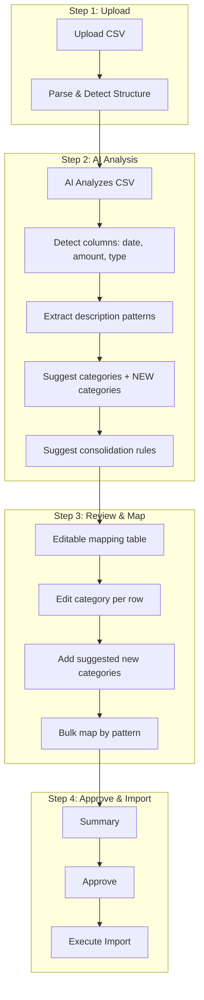

# CSV Import: Smart AI Wizard Plan

## Current Issues

1. **Income not imported** – Only expenses (withdrawals) imported; deposits may use different column names (Cr/Dr, Transaction Type, Amount with sign, etc.)
2. **No mapping review** – Upload → Preview → Import with no chance to edit category assignments
3. **No AI analysis** – Rigid keyword matching; no smart suggestions
4. **No new category suggestions** – AI cannot propose creating new categories (e.g. Payroll) when data doesn't fit existing ones
5. **Not a wizard** – Single-step flow instead of guided step-by-step experience

---

## Proposed: Smart AI Import Wizard



---

## Wizard Steps (Detailed)

### Step 1: Upload
- User uploads CSV
- Parser detects structure (flexible: Withdrawals/Deposits, Debit/Credit, Amount+Type, Cr/Dr, etc.)
- Show detected columns and sample rows
- **Fix for income:** Support more column variants (see below)

### Step 2: AI Analysis
- **AI (Gemini) analyzes:**
  - CSV structure and column meanings
  - Unique description patterns (e.g. "Salary- Jan *", "UPI/*", "NEFT-*")
  - Suggested mapping to existing categories
  - **Proposed NEW categories** when data doesn't fit (e.g. "Payroll", "Consultancy Fees")
  - Consolidation rules (e.g. group similar descriptions)
- Return: `{ expenseRows, incomeRows, suggestedMappings, proposedNewCategories }`

### Step 3: Review & Map
- Editable table: date, particulars, amount, type (expense/income), **category dropdown**, cost center
- Show AI-suggested categories; user can override
- **"Add new category"** – Create suggested categories (Payroll, etc.) with one click
- Bulk actions: "Map all 'Salary-*' to Payroll"
- Consolidate: Merge duplicate/similar rows (optional)

### Step 4: Approve & Import
- Summary: X expenses, Y income, category breakdown
- Confirm and execute
- Import both expenses and income

---

## Fix: Income Not Importing

**Likely cause:** Bank CSV uses different column names. Common variants:

| Bank / Format | Expense Column | Income Column |
|---------------|----------------|---------------|
| HDFC/SBI standard | Withdrawals, Debit | Deposits, Credit |
| Some exports | Dr | Cr |
| Single Amount | Amount (negative = expense) | Amount (positive = income) |
| Type + Amount | Transaction Type = Debit | Transaction Type = Credit |

**Parser changes needed:**
- Add: `["dr", "debit amt", "withdrawal amt"]` for expenses
- Add: `["cr", "credit amt", "deposit amt"]` for income
- Support **single Amount column + Transaction Type** (Credit/Debit, Cr/Dr)
- Support **signed Amount** (negative = expense, positive = income)

---

## Implementation Phases

### Phase 1: Parser Fix (Income + More Formats)
- Extend column detection for Cr/Dr, Transaction Type + Amount, signed Amount
- Ensure both expenses and income are parsed and imported
- **Effort:** Small (0.5–1 day)

### Phase 2: Wizard UI Shell
- Stepper component: Step 1 → 2 → 3 → 4
- Step 1: Upload (existing, improved)
- Step 2: Placeholder "Analyzing..." (calls new API)
- Step 3: Editable mapping table (no AI yet)
- Step 4: Summary + Execute
- **Effort:** Medium (1–2 days)

### Phase 3: AI Analysis API
- `POST /api/admin/expenses/import/analyze` – Gemini:
  - Infers CSV structure (columns, expense vs income)
  - Extracts patterns, suggests categories
  - **Proposes new categories** when needed
  - Returns full mapping plan
- **Effort:** Medium (2–3 days)

### Phase 4: Full Wizard Integration
- Wire AI analysis into Step 2
- "Add new category" from AI suggestions
- Bulk mapping by pattern
- Consolidation (optional)
- **Effort:** Medium (1–2 days)

---

## API Contract (Draft)

**POST /api/admin/expenses/import/analyze**
- Input: `{ file, tenantId }`
- Output:
```json
{
  "expenseRows": [...],
  "incomeRows": [...],
  "suggestedMappings": { "rowIndex": "categoryId" },
  "proposedNewCategories": [
    { "name": "Payroll", "slug": "payroll", "reason": "10 rows match 'Salary-*'" }
  ],
  "columnMapping": { "date": "Date", "amount": "Withdrawals", ... }
}
```

**POST /api/admin/expenses/import/execute**
- Input: `{ file, tenantId, categoryOverrides?, newCategoriesToCreate?, costCenterOverrides? }`
- Creates new categories if requested, then imports with overrides

---

## Immediate Fixes (Done)

- Salary keywords → miscellaneous
- Fallback to miscellaneous (not first category)
