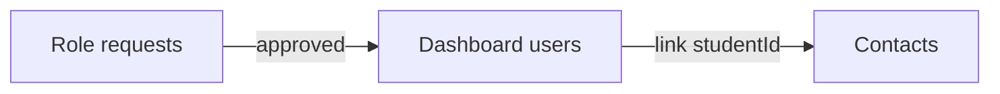

# Admin UI — long-term information architecture

This doc describes a **scalable, intuitive** way to organize admin navigation and URLs.

**Implemented (client):** Path-based FinJoe routes under `/admin/finjoe/...`, dashboard as default after login, Team merged into FinJoe → Dashboard users. See [plans/admin-ia-implementation.plan.md](plans/admin-ia-implementation.plan.md) and `client/src/lib/finjoe-routes.ts`.

## Design principles

1. **Task-based top nav** — Users think “what am I doing?” (review money, fix a contact, invite someone), not “which product module name?”
2. **One place for “people”** — WhatsApp contacts, dashboard logins, and role requests are different *states* of the same human graph (invite → approve → link). They should live under one parent, not scattered in the sidebar.
3. **URLs mirror hierarchy** — Bookmarkable, supportable, and RBAC-friendly: `/admin/<area>/<resource>/...`
4. **Shallow sidebar** — Few top-level items; use sub-nav or left sub-menus inside an area when it grows.
5. **Rename over time if needed** — “FinJoe” can remain the *product* name while the nav label becomes **Organization**, **Workspace**, or **Channel setup** if that matches tenant mental models better.

## Recommended long-term structure

### Top-level sidebar (example)

| Top item | Holds |
|----------|--------|
| **Dashboard** | Default home after login; KPIs, shortcuts, onboarding nudges |
| **Money** | Expenses, Income, Recurring (both), Reconciliation, Invoicing, Reports |
| **Organization** (or keep **FinJoe** as label) | Everything that defines *who* and *how* the tenant talks to FinJoe |
| **System** (super_admin only) | Tenants, Cron, Account settings |

“Money” can stay as separate top-level items initially; grouping is optional until the sidebar feels crowded.

### Under **Organization** / FinJoe (nested IA)

Use a **two-level** pattern: section + page.

| Section | Pages | User mental model |
|---------|--------|-------------------|
| **Structure** | Cost centers (campuses, departments) | Where work happens |
| **People** | Contacts · Dashboard users · Role requests | Who is in the system and how they get in |
| **Integrations** | WhatsApp, email templates, webhooks (split from today’s single Settings tab as you grow) | How messages flow |

**People** is the intuitive core: three tabs or routes that map to a funnel:

### URL shape (north star)

Prefer **path-based** nested routes over many query params:

- `/admin/organization/structure/cost-centers`
- `/admin/organization/people/contacts`
- `/admin/organization/people/users` (today’s “Team”)
- `/admin/organization/people/role-requests`
- `/admin/organization/integrations/settings` (then split: `.../whatsapp`, etc.)

`tenantId` for super_admin can remain a query param: `?tenantId=` on any of the above.

Benefits: stable deep links, clearer analytics, easier per-route guards.

## Phased migration (practical)

1. **Done** — Dashboard as post-login home; FinJoe uses nested paths (`/admin/finjoe/structure/...`, `/people/...`, `/integrations/...`); `/admin/team` and bare `/admin/finjoe` redirect with `tenantId` preserved.
2. **Next (optional)** — Rename top-level nav label from “FinJoe” to “Organization” if tenants find it clearer; split Settings into `/integrations/whatsapp`, etc., when content grows.
3. **Later** — Group Money routes (Expenses, Income, …) under one sidebar section without changing URLs.

## What to avoid long-term

- Multiple sidebar entries for things that are one workflow (contacts vs team vs invites).
- A single flat `/admin/*` list with 15+ peers and no grouping.
- Relying only on `?tab=` without ever moving to paths once the area stabilizes (tabs are fine **inside** a section, less ideal as the **only** URL for a whole product area).

---

*Last updated: aligns with the Admin IA / FinJoe / Team plan; iterate this doc when routes change.*
